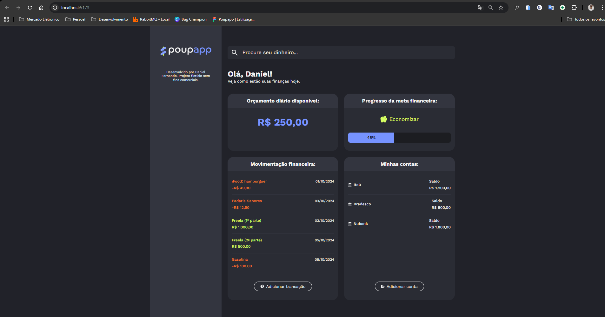

# PoupApp

## 🎯 Visão Geral  
O **PoupApp** é um projeto fictício de gerenciamento de finanças pessoais, criado com o propósito de estudo de **CSS Modules** em combinação com React + Vite. Ele foi desenvolvido durante minha realização do curso **React: utilizando CSS Modules e Tailwind para estilização de componentes** da Alura. Ele permite visualizar receitas e despesas, saldos bancários, movimentações financeiras e metas de economia financeiras.



O conteúdo do projeto é totalmente estático, visto que o objetivo é o estudo de CSS Modules para estilização de interface. Você pode acessar o projeto ao vivo através do endereço https://poupapp-theta.vercel.app/

## 🛠 Tecnologias  
- React (versão utilizada: 19.1.1)  
- Vite para build e desenvolvimento rápido  
- CSS Modules para encapsular estilos por componente  
- JavaScript   

## 🚀 Instalação  
Siga estes passos para preparar o projeto localmente:

```bash
# 1. Clone o repositório: 
git clone https://github.com/danielft11/poupapp.git
cd poupapp

# 2. Instale as dependências:
npm install

# 3. Inicie o servidor de desenvolvimento:
npm run dev

